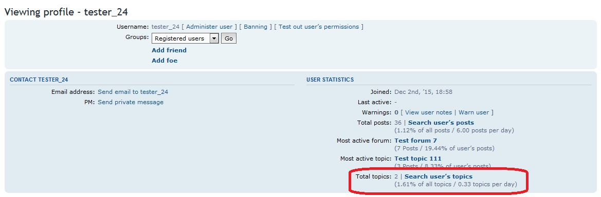

Search user topics
===============

phpBB 3.1 Search user topics extension

Extension will display a count of topics with a clickable link a user has started within a users profile.

Profile Page


[](https://travis-ci.org/RMcGirr83/phpBB-3.1-searchusertopics)

## Installation

### 1. clone
Clone (or download and move) the repository into the folder ext/rmcgirr83/searchusertopics:

```
cd phpBB3
git clone https://github.com/RMcGirr83/phpBB-3.1-searchusertopics.git ext/rmcgirr83/searchusertopics/
```

### 2. activate
Go to admin panel -> tab customise -> Manage extensions -> enable Search user topics

## Update instructions:
1. Go to your phpBB-Board > Admin Control Panel > Customise > Manage extensions > Search user topics: disable
2. Delete all files of the extension from ext/rmcgirr83/searchusertopics
3. Upload all the new files to the same location
4. Go to your phpBB-Board > Admin Control Panel > Customise > Manage extensions > Search user topics: enable